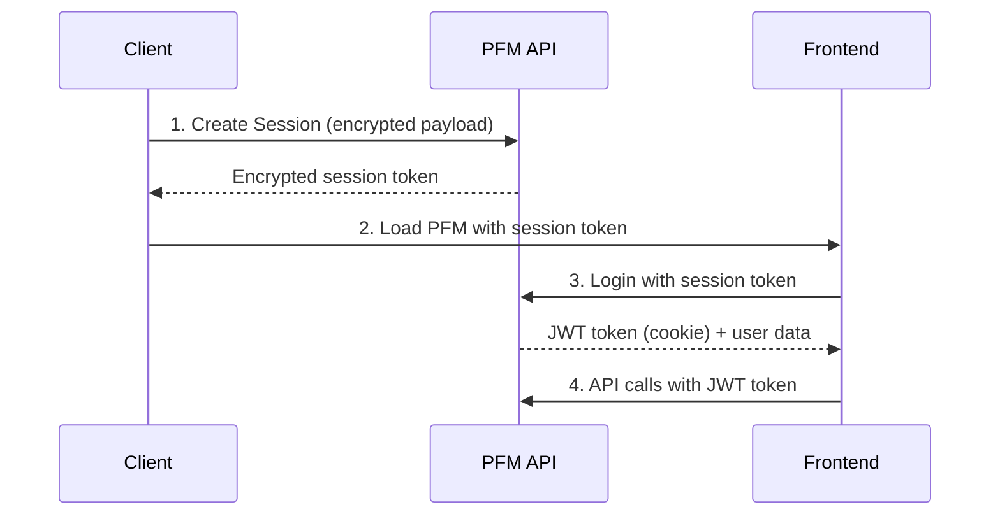

# Authentication & Session Management

## Overview

Setu PFM uses a secure session-based authentication system with JWT tokens for API access. All sessions are encrypted using AES-256 encryption.

## Authentication Flow



## Session APIs

### 1. Create Session

Creates a new session for user authentication.

**Endpoint:** `POST /api/session`

**Headers:**
```http
x-api-key: YOUR_API_KEY
Content-Type: text/plain
```

**Request Body:** Encrypted payload containing:
```json
{
    "mobileNumber": "string (10 digits)",
    "panNumber": "string (optional)",
    "customerId": "string (optional)",
    "source": "string",
    "landingPage": "string",
    "expiry": "ISO8601 datetime (optional)",
    "shouldRefreshData": "boolean (optional)"
}
```

**Response:**
```json
{
    "data": "encrypted_session_token"
}
```

### 2. Login

Authenticates the user and creates a JWT token.

**Endpoint:** `POST /api/session/login`

**Request:**
```json
{
    "data": "encrypted_session_token"
}
```

**Response:**
```json
{
    "user_id": 123,
    "session_id": "uuid",
    "expiry": "2023-12-21T13:27:07.167099",
    "landing_page": "main_summary",
    "mobile_number": "98765xxxxx",
    "consent_approved": true,
    "source": "your-app",
    "user": {
        "id": "user-uuid",
        "verified_pan": true,
        "customer_id": "customer-id"
    },
    "is_consent_approved": true,
    "version": "1.0.0"
}
```

**Response Headers:**
```http
set-cookie: token=jwt_token_here; HttpOnly; Secure; SameSite=Strict
```

### 3. Refresh Session

Extends the session validity by 10 minutes.

**Endpoint:** `POST /api/session/refresh`

**Headers:**
```http
Cookie: token=jwt_token_here
```

**Response:** Same as login response with updated expiry

### 4. Logout

Terminates the current session.

**Endpoint:** `POST /api/session/logout`

**Headers:**
```http
Cookie: token=jwt_token_here
```

**Response:**
```json
{
    "message": "Successfully logged out"
}
```

## JWT Token Management

### Token Structure
- **Validity:** 10 minutes from creation
- **Type:** HTTP-only secure cookie
- **Refresh:** Can be refreshed unlimited times

### Using JWT Token
Include the JWT token cookie in all API requests:
```http
Cookie: token=jwt_token_here
```

### Token Expiry Handling
```javascript
// Example error response for expired token
{
    "error": "Session expired",
    "code": "SESSION_EXPIRED"
}

// Handle in client
if (response.code === 'SESSION_EXPIRED') {
    // Redirect to login or refresh session
}
```

## Encryption Details

### Algorithm Specifications
- **Algorithm:** AES-256
- **Mode:** CBC (Cipher Block Chaining)
- **Padding:** PKCS5
- **Initialization Vector:** Random 16 bytes

### Encryption Process
1. Generate random 16-byte IV
2. Encrypt payload using AES-256-CBC
3. Prepend IV to encrypted data
4. Base64 encode the result

### Java Implementation Example
```java
import javax.crypto.Cipher;
import javax.crypto.spec.IvParameterSpec;
import javax.crypto.spec.SecretKeySpec;
import java.util.Base64;
import java.util.Random;

public String encrypt(String key, String plaintext) {
    byte[] initVector = new byte[16];
    new Random().nextBytes(initVector);
    
    IvParameterSpec iv = new IvParameterSpec(initVector);
    SecretKeySpec skeySpec = new SecretKeySpec(key.getBytes("UTF-8"), "AES");
    
    Cipher cipher = Cipher.getInstance("AES/CBC/PKCS5PADDING");
    cipher.init(Cipher.ENCRYPT_MODE, skeySpec, iv);
    
    byte[] encrypted = cipher.doFinal(plaintext.getBytes());
    byte[] combined = new byte[initVector.length + encrypted.length];
    
    System.arraycopy(initVector, 0, combined, 0, 16);
    System.arraycopy(encrypted, 0, combined, 16, encrypted.length);
    
    return Base64.getEncoder().encodeToString(combined);
}
```

## Security Best Practices

### API Key Management
- Store API keys securely in server environment
- Never expose API keys in client-side code
- Rotate API keys periodically

### Session Security
- Implement session timeout on client side
- Clear sessions on app logout
- Validate session state before sensitive operations

### Encryption Key Security
- Store encryption keys in secure key management systems
- Use different keys for different environments
- Implement key rotation policies

## Error Handling

### Common Authentication Errors

| Error Code | Description | Resolution |
|------------|-------------|------------|
| `INVALID_API_KEY` | API key is invalid or missing | Verify API key in headers |
| `SESSION_EXPIRED` | Session has expired | Create new session or refresh |
| `INVALID_PAYLOAD` | Encryption/decryption failed | Check encryption implementation |
| `UNAUTHORIZED` | JWT token invalid or missing | Re-login to get new token |

### Rate Limiting
- Session creation: 10 requests per minute per IP
- API calls: 100 requests per minute per user
- Implement exponential backoff for retries